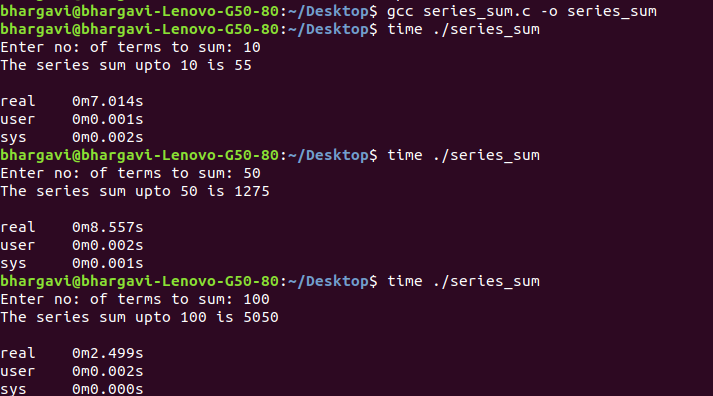

## Observation report: 

__Time Complexity of algorithm/code is not equal to the actual time required to execute a particular code but the number of times a statement executes.__  
The following are the commands used to find the time taken for execution in C
	
> $gcc program.c – o program 
> $time ./program 

<!--  -->

These are the compilation results of the sum of series program in Linux based O.S i.e. Ubuntu  
__Quick things to be observed from the image results:__
>* When the program is compiled and executed 
>* n=10, time is 0.7ms 
>* n=50, time is 0.8ms 
>* n=100, time is 0.2ms  

So, we can say that actual time required to execute code is machine dependent.
Hence, Instead of measuring actual time required in executing each statement in the code, we consider how many times each statement execute.
