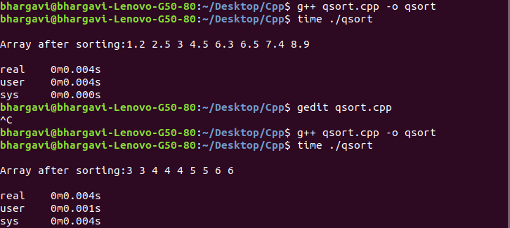
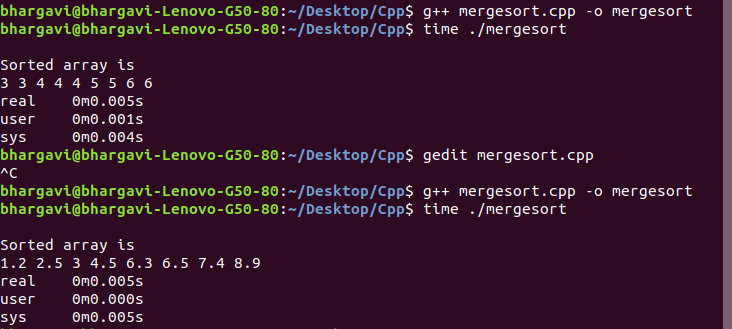

# Assignment-3</br>
## Find out Time complexity for Quick sort and Merge sort Algorithms 
### Also find Execution time for the given arrays using quick and merge sort
### 1. A[2.5,4.5,3.0,1.2,6.5,8.9,7.4,6.3]</br> 2. B[5,3,6,3,4,5,4,6,4] 

# Quick Sort Algorithm:
```cpp
Partition(Arr,low,high)
{
        pivot = Arr[low];
        i = low;
        j = high;
        while(i<j)
        {
                do
                {
                        i++;
                }while(Arr[i] <= pivot and i<j);
                do
                {
                        j++;
                }while(Arr[j] > pivot);
                if(i<j)
                        swap(Arr[i],Arr[j]);
        }
        swap(Arr[low],Arr[j]);
        return j;
}

Quicksort(Arr,low,high)
{
        if(low<high)
        {
                i = Partition(Arr,low,high);      //Takes time 'n' (n = length of the array)
                Quicksort(Arr,low,i-1);
                Quicksort(Arr,i+1,high);         
                //Dividing of above two commands goes upto logn levels. Therefore, takes 'logn' time
        }
}
```

1. Quick sort follows divide and conquer strategy.
2. The above algorithm functions recursively. </br>
**Time Complexity = O(n*logn)  [Best case and Average case]**</br>
**Time Complexity = O(n^2)  [Worst case]**</br></br>

### Execution time taken for sorting arrays with Quick sort using C++



# Merge Sort Algorithm:
```cpp

Mergesort(Arr[],low,high)                        
{
        if(low < high)
        {
                mid = (low + high)/2;      // Constant time
                Mergesort(Arr,low,mid);        // T(n/2) time
                Mergesort(Arr,mid+1,high);     // T(n/2) time
                Merge(Arr,low,mid,high);       // T(n) time
        }
}

```
1. Merge sort also follows Divide and Conquer strategy.
2. The above algorithm functions recursively</br>
3. Recurrence relation: T(n) = 2T(n/2) + n

**Time Complexity is O(n*logn)  [For Best,Average and Worst cases]**</br></br>

### Execution time taken for sorting arrays with Merge sort using C++



## Observation:
On observing the results of sorting the arrays using Quick and Merge sort, we can say that Quick sort is fast compared to Merge sort (Since array sizes are small).Quick sort is in-place sorting and this sorting is done in main memeory, whereas Merge sort needs auxiliary memory for sorting.So, Quick sort is more preferred for sorting arrays. 
</br></br>
**NOTE:**
1. Merge sort is more efficient and works faster than quick sort in case of *large array size*
2. Quick sort is more efficient and works faster than Merge sort in case of *small array size or data*
